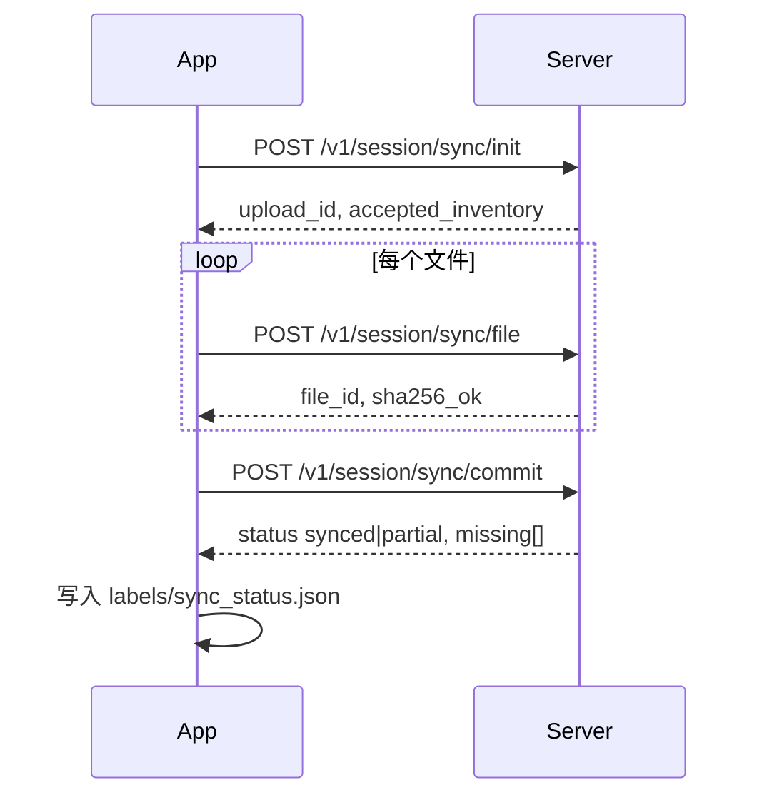

# Nuna 会话数据格式与服务器同步协议（v1）

本文约定 App 端 **会话目录** 结构、**context 多模态标签** 格式，以及 **可断点、可确认** 的服务器同步流程。

### 实现类索引（App）

| 协议章节 | Kotlin 实现 |
|----------|-------------|
| §1 目录结构 | `session/SessionPaths.kt` |
| §1.1 `manifest.json` | `session/SessionManifest.kt` |
| §1.2 `context/context.jsonl` | `service/ContextDataService.kt` |
| §1.3 `labels/sync_status.json` | `sync/SessionSyncStatus.kt` |
| §1 `labels/vad_prelabel.json` | `vad/VadPrelabelWriter.kt` |
| §2 同步流程 | `sync/SessionSyncCoordinator.kt`, `sync/SessionSyncUploader.kt` |

---

## 1. 本地会话目录结构

路径：`Downloads/nuna_{device}_{started_at_ms}/`

| 相对路径 | 说明 |
|----------|------|
| `manifest.json` | 会话元数据、音频分段列表、VAD 摘要 |
| `audio/seg_XXX.opus` | 裸 Opus 流，每段约 60s |
| `context/context.jsonl` | GPS / IMU / **身体活动** 等时序标签（JSONL） |
| `labels/vad_prelabel.json` | Silero VAD 预标注 |
| `labels/sync_status.json` | **本机** 服务器同步状态（不上传亦可由服务端生成） |

### 1.1 `manifest.json`（format_version = 1）

见代码 `SessionManifest`；关键字段：

- `session_id`, `started_at_ms`, `ended_at_ms`
- `audio.segments[]`: `index`, `file`, `start_ms`, `end_ms`, `bytes`, `duration_ms`
- `context.file` → 固定 `context/context.jsonl`
- `vad` → `labels/vad_prelabel.json`

### 1.2 `context/context.jsonl`（每行一个 JSON）

| type | 含义 | 示例字段 |
|------|------|----------|
| `meta` | 采集开始 | `started_at_ms`, `modalities` |
| `imu` | IMU | `sensor`: accel/gyro/mag, `x,y,z`, `t_ms` |
| `gps` | GPS | `lat,lon,alt,acc,speed,bearing`, `t_ms` |
| `activity` | **身体活动** | `state`: STILL/WALKING/RUNNING/IN_VEHICLE/…, `confidence` 0–100, `t_ms` |

活动状态来自 Android Activity Recognition API（需 Google Play 服务）。

### 1.3 `labels/sync_status.json`（客户端维护）

```json
{
  "format_version": 1,
  "session_id": "nuna_device_1779450128225",
  "status": "synced",
  "upload_id": "uuid",
  "server_session_id": "server-optional-id",
  "updated_at_ms": 1779450200000,
  "files": [
    {
      "path": "manifest.json",
      "sha256": "hex",
      "size": 1234,
      "status": "synced",
      "uploaded_at_ms": 1779450190000,
      "error": null
    }
  ],
  "summary": {
    "total": 12,
    "synced": 12,
    "failed": 0,
    "pending": 0
  },
  "last_error": null
}
```

**status 枚举（会话级）**

| 值 | 含义 |
|----|------|
| `none` | 从未同步 |
| `syncing` | 同步进行中（勿删本地文件） |
| `synced` | 服务端已确认全部成功 |
| `partial` | 部分文件失败或 commit 未通过 |
| `failed` | 整体失败（如 init 被拒） |

**files[].status**：`pending` | `uploading` | `synced` | `failed`

---

## 2. 同步流程（推荐服务端实现）

目标：**先登记、再逐文件上传、最后 commit 校验**，避免「发到一半当成功」。



### 2.1 `POST /thingx/api/v1/session/sync/init`

**Request** `application/json`

```json
{
  "client_upload_id": "uuid-v4",
  "session_id": "nuna_device_1779450128225",
  "user_id": "user-001",
  "device_mac": "AA:BB:CC:DD:EE:FF",
  "started_at_ms": 1779450128225,
  "ended_at_ms": 1779450500000,
  "manifest": { },
  "files": [
    { "path": "manifest.json", "sha256": "...", "size": 2048, "media_type": "application/json" },
    { "path": "context/context.jsonl", "sha256": "...", "size": 8192, "media_type": "application/x-ndjson" },
    { "path": "labels/vad_prelabel.json", "sha256": "...", "size": 4096, "media_type": "application/json" },
    { "path": "audio/seg_000.opus", "sha256": "...", "size": 480000, "media_type": "audio/opus" }
  ]
}
```

**Response** `200`

```json
{
  "upload_id": "server-upload-uuid",
  "server_session_id": "optional",
  "expires_at_ms": 1779453800000
}
```

服务端应保存 **期望文件清单**（path + sha256），未在 commit 中出现则视为未同步。

### 2.2 `POST /thingx/api/v1/session/sync/file`

**Request** `multipart/form-data`

| 字段 | 说明 |
|------|------|
| `upload_id` | init 返回 |
| `relative_path` | 如 `audio/seg_000.opus` |
| `sha256` | 十六进制，与 init 一致 |
| `file` | 二进制 |

**Response** `200`

```json
{
  "relative_path": "audio/seg_000.opus",
  "status": "received",
  "sha256_verified": true,
  "file_id": "optional"
}
```

可重复上传同一路径（幂等）；服务端校验 sha256 不一致返回 `409`。

### 2.3 `POST /thingx/api/v1/session/sync/commit`

**Request** `application/json`

```json
{
  "upload_id": "server-upload-uuid",
  "client_upload_id": "uuid-v4",
  "files": [
    { "path": "manifest.json", "sha256": "..." },
    { "path": "audio/seg_000.opus", "sha256": "..." }
  ]
}
```

**Response** `200`

```json
{
  "status": "synced",
  "missing": [],
  "checksum_mismatch": []
}
```

| status | 含义 |
|--------|------|
| `synced` | 清单内文件全部收到且校验通过 |
| `partial` | 有缺失或校验失败，见 `missing` / `checksum_mismatch` |

**只有 `status == synced` 时，App 将会话标为已同步。**

### 2.4 （可选）`GET /thingx/api/v1/session/sync/status?upload_id=`

用于 App 重启后向服务端查询进度；响应结构与 `sync_status.json` 类似。

---

## 3. 兼容旧接口（回退）

若 v1 接口返回 `404`，App 可回退为 **按文件调用** 既有接口：

`POST /thingx/api/file/upload/audio`（multipart: `file` + `metadata`）

此时 **无法保证会话级 commit**，`sync_status` 记为 `partial`，并在 UI 提示「服务端未升级 v1 同步」。

---

## 4. App 端行为摘要

1. 上传前根据磁盘文件生成 **清单 + SHA-256**。
2. `sync_status.status = syncing`，逐文件更新 `files[].status`。
3. 全部 `synced` 且 commit 返回 `synced` → 会话级 `synced`。
4. 任一失败 → `partial`，UI 展示失败文件数，支持 **重试同步**（仅重传 failed/pending）。

---

## 5. 安全与大小

- 建议 HTTPS；`user_id` / `device_mac` 与现有 metadata 一致。
- 大会话可限制单文件大小或分片（v2）；v1 假定单段 Opus &lt; 64MB。
- `client_upload_id` + `upload_id` 双重关联，防止 commit 错会话。
