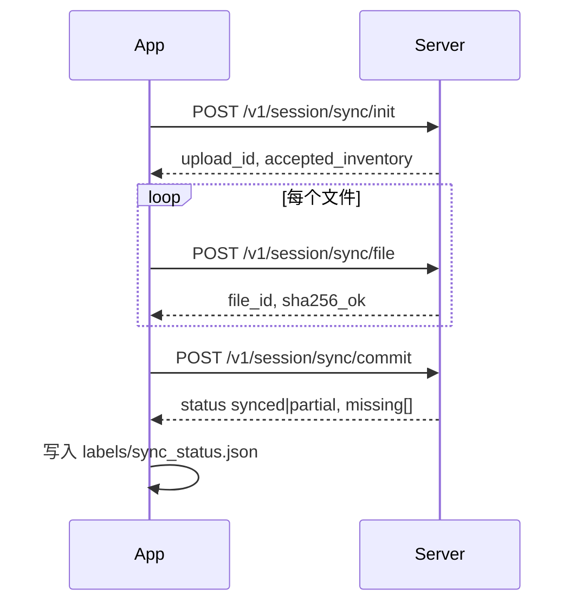

# Nuna 会话数据格式与服务器同步协议（v1）

本文约定 App 端 **会话目录** 结构、**context 多模态标签** 格式，以及 **可断点、可确认** 的服务器同步流程。

### 实现类索引（App）

| 协议章节 | Kotlin 实现 |
|----------|-------------|
| §1 目录结构 | `session/SessionPaths.kt` |
| §1.1 `manifest.json` | `session/SessionManifest.kt` |
| §1.2 `context/context.jsonl` | `service/ContextDataService.kt` |
| §1.3 `labels/sync_status.json` | `sync/SessionSyncStatus.kt` |
| §1.4 `context/mmwave*.jsonl` | `recording/MmWaveSessionWriter.kt`, `ble/NunaProtocolInspector.kt` |
| §1 `labels/vad_prelabel.json` | `vad/VadPrelabelWriter.kt` |
| §2 同步流程 | `sync/SessionSyncCoordinator.kt`, `sync/SessionSyncUploader.kt` |

---

## 1. 本地会话目录结构

路径：`Downloads/nuna_{device}_{started_at_ms}/`

| 相对路径 | 说明 |
|----------|------|
| `manifest.json` | 会话元数据、音频分段列表、VAD 摘要 |
| `audio/seg_XXX.opus` | 裸 Opus 流，每段约 60s |
| `context/context.jsonl` | GPS / IMU / **身体活动** 等时序标签（JSONL） |
| `context/mmwave.jsonl` | 毫米波原始包（见 §1.4）；**旧会话没有这个文件** |
| `context/mmwave_state.jsonl` | 毫米波开关时间线（见 §1.4）；**旧会话没有这个文件** |
| `labels/vad_prelabel.json` | Silero VAD 预标注 |
| `labels/sync_status.json` | **本机** 服务器同步状态（不上传亦可由服务端生成） |

### 1.1 `manifest.json`（format_version = 1）

见代码 `SessionManifest`；关键字段：

- `session_id`, `started_at_ms`, `ended_at_ms`
- `audio.segments[]`: `index`, `file`, `start_ms`, `end_ms`, `bytes`, `duration_ms`
- `context.file` → 固定 `context/context.jsonl`
- `vad` → `labels/vad_prelabel.json`

> **`start_ms` 是相对 `started_at_ms` 的偏移，不是 epoch。**
> 绝对时间 = `started_at_ms + start_ms`。服务端曾把它当 epoch 用，
> 整批数据落到 1970-01-01。

#### 2026-08-01 新增字段（向后兼容，旧会话没有这些键）

| 字段 | 含义 |
| --- | --- |
| `audio.segments[].frames` | 该段的帧账目，见下 |
| `audio.missing_segments[]` | 完全没有音频的分段序号（链路中断） |
| `audio.deleted_segments[]` | `{index, deleted_at_ms}`，参与者主动删除 |
| `link` | 断连区间与重组器诊断 |

`frames` 把缺失分成两类，因为归属完全不同：

```json
{
  "unit": "opus_packet_20ms",
  "expected": 3000,          // 按墙钟应有的 20ms 包数
  "received": 2952,          // 实际写入的包数
  "missing": 48,             // expected − received，恒等于两者之差
  "device_frames": {         // ⚠️ 这一层的单位是**设备帧**，不是 20ms 包
    "received": 82,          // 收到的设备帧数
    "sequence_lost": 2,      // 设备 frameId 序号上的空洞 → 帧发了但没到（链路丢包）
    "gaps": [{"at_frame_offset": 1200, "missing_frames": 48, "next_frame_id": 6418}]
  }
}
```

> ⚠️ **`device_frames` 里的计数与外层不同量纲。**外层是 20ms Opus 包，这一层是**设备帧**。
>
> **协议上换算比不固定**——帧长由设备在 A003 帧头的 `frameSize` 字段逐帧声明
> （`OpusStreamAssembler.kt`），代码里没有写死的常量。
> **但实测它一直是 36，而且硬到可以拿来写断言。** 三方独立核过（2026-08-19）：
>
> | 核实方 | 方法 | 结果 |
> | --- | --- | --- |
> | `platform` | 服务端**解码实际到达的字节** | 2462/2462 文件包数被 36 整除 |
> | `mobile` | 复算 manifest 的 `received` | **最大公约数恰好 36，零例外** |
> | `root` | 全库 manifest 扫描 | `received % 36 == 0` **2337/2337**，含截断段 |
>
> **两句话都要说，因为它们各挡一件事**：
> 「**不是协议常量**」挡的是把 36 写进契约当保证；
> 「**2337/2337**」挡的是因为它不是常量就以为不能用——**它能做断言，见下。**
>
> **设备交付音频的最小不可分单位因此是 36 × 20ms = 720ms：
> 你永远不会丢一个 20ms 包，只会整组丢 0.72 秒。**

#### 两条可以直接写进解析代码的断言

```
received % 36 == 0        # 36 换了 → 固件改了帧长，所有 720ms 粒度的分析都要重看
missing   >= -36          # 注意是 −36，不是 0
```

> 🔴 **第二条为什么不能写 `missing >= 0`**：**负数在正确数据里就有**——
> `root` 全库实测 **194/2337 段（8.3%）`missing < 0`**，最负的
> `expected=1910, received=1944` → `−34`。原因就是量化：
> **一段可以比它的名义窗多收一整个设备帧。**
>
> **写 `missing >= 0` 的后果不是漏报，是它第一次响就响在正确数据上，
> 然后被人一路调宽到不再响为止**——`AGENTS.md` §5「为了让迁移过去而放宽 CHECK」
> 的完整形状，只是这次发生在断言上。
>
> **一个"不可能的值"断言，必须先知道正确值的粒度。
> 不知道粒度就写出来的断言，第一次响的是正确数据。**

#### ⚠️ `missing` 是残差，不是观测——不要拿它当链路质量

`expected == received + missing` 在全库 2337/2337 段成立，也就是说
**`missing` = 名义墙钟 − 盘上字节**，设备侧、链路侧、轮转边界和一切别的原因
**全被吸收进这一个数**。

- ✅ 它回答「**这一分钟有多少音频**」——对；
- ❌ 它回答「**链路丢了多少**」——错。

**要链路质量，看 `link.assembler` 和 `device_frames.sequence_lost`。**
（`sequence_lost` 在 08-08 / 08-10 / 08-14 分别是 1 / 239 / 77，**不是恒零**——
所以按旧文档从顶层读它得到 0，是真的会骗人。）

**外层唯一的恒等式：`missing == expected − received`**，它**不减** `sequence_lost`
——设备帧的空洞已经体现在 `received` 变小里了，再减一次是重复扣。

#### 做质量统计的人必须先知道这条

60 秒 ÷ 0.72 秒 = **83.33 组，不是整数**，所以一个"满"段**根本达不到 `expected`**，
只能是 82 组（59.0s）或 83 组（59.8s），偶尔 84 组（60.5s，此时 `missing` 为负）。

**把 `fill < 1` 当成丢包，会把大批健康段判成有问题。** 2026-08-19 实测（2351 个非末段）：

| | 占比 | 缺失率 |
| --- | ---: | ---: |
| ≥82 组（健康） | 83% | **1.00%**（纯边界量化） |
| <82 组 | 17% | 均值 68.6 组，**贡献了全部缺失的 79%** |
| 全体 | — | 3.92% |

**所以缺失不是"人人少一点"的基线，是 17% 的段扛了 79%。**

> **本节 2026-08-19 更正。** 此前这里写的是顶层 `sequence_lost` / `unaccounted` / `gaps`，
> **而代码从来没有输出过那个形状**——真实输出是上面这个（`RecordingIntegrity.kt:66`）。
> 按旧文档解析的下游会取不到 `sequence_lost`（默认成 0）、找不到 `unaccounted`。
> **这是"冻结了一份声明，而行为在别处"的实例**：文档冻住了，代码按自己的样子在写，
> 两边从没对过。**已点名 platform 与 benchmark 复核他们的解析。**

**不做补偿**：不补零、不拉伸时间轴。段短了就是短了，空洞位置如实上报。

#### 一条可以直接拿去查数据的恒等式

```
segments[].bytes  ==  frames.received × 80
```

**它必须严格相等**（Opus 帧固定 80 字节）。不相等意味着两件事之一，
而且**不需要任何新字段就能在历史数据上验**——这是它比新增计数器有用的地方：
新字段只管以后，恒等式管过去。

| 观察 | 含义 |
| --- | --- |
| `bytes < received × 80` | **帧到了但没写进磁盘**（磁盘满 / 权限 / 目录被删）。文件比账目声称的短 |
| `bytes == received × 80 × 36` | **08-03 那批的量纲 bug**：当时 `received` 数的是设备帧，一个设备帧 36 个 Opus 帧。见 `app_version`（那批为空） |
| 相等 | 正常 |

2026-08-17 用它扫过全部 2430 个带 `frames` 的分段：**`bytes < received × 80` 的 0 个**，
93 个不等的全部是上面那个量纲 bug（比值精确 36.0）。
**所以到 v1.36 为止，没有任何一次音频写入失败发生过**，
而 `sequence_lost` 里也就不可能混着写失败——**历史链路可靠性结论是干净的**。

> ⚠️ **v1.37 起这条推理不再成立**：写失败的帧不再进帧账目，于是它会表现为
> `sequence_lost`（frameId 空洞），也就是被归因到链路丢包。
> 修法见 T-2026-08-17-061（加只增字段 `write_failed`）。**在那之前，
> v1.37+ 数据里的 `sequence_lost` 是"链路丢包或写入失败"，不是纯链路。**

`link` 里的时间是**绝对 epoch 毫秒**（字段名带 `_at_ms` 以示区分）：

```json
{
  "disconnect_count": 1,
  "total_down_ms": 55000,
  "events": [
    {"start_at_ms": 1800000060000, "end_at_ms": 1800000115000,
     "reason": "connection_timeout(8)", "reconnect_attempts": 3, "down_ms": 55000}
  ],
  "assembler": {"resync_skipped_bytes": 137, "incomplete_frames": 2,
                "duplicate_frames": 1, "reordered_frames": 4,
                "dropped_carry_over_bytes": 60}
}
```

`end_at_ms` 为 `null` 表示会话结束时链路仍未恢复。

##### `events[]` 里混着两种东西——2026-08-14 更正

`events` 同时装**链路故障**和**我方主动造成的空档**（录声纹暂停、毫米波开关）。
两者都表现为"这段时间没有音频"，所以放在一起；但 **2026-08-14 之前
`disconnect_count` 是 `events.size`**，把主动空档也算成了断连。

移植毫米波之后这个错误变得很显眼：固件每 30 秒开关一次雷达，每次关闭记一条
`mmwave_toggle`，于是**一个整点会话报了 41 次断连，真实断连只有 6 次**。
用户当时的反馈是"断联频率好像高了不少"，而同一批数据的音频覆盖率反而从
77% 涨到 96%——**数字在撒谎，链路其实是变好的**。

现在：

- `disconnect_count` / `total_down_ms` **只统计真正的链路故障**；
- 新增 `link.intentional_gap_count`；
- 每条 event 新增 `intentional: true|false`，下游不必再靠字符串匹配 `reason`。

**已入库的旧会话不会被改写**：`app_version ≤ 1.27 (28)` 的 manifest 里，
`disconnect_count` 仍是含主动空档的旧口径，重新统计时请按 `reason` 过滤
（`mmwave_toggle`、`voiceprint_capture`）。

#### 2026-08-14 新增字段（向后兼容，旧会话没有这些键）

| 字段 | 含义 |
| --- | --- |
| `app_version` | 采集端版本，如 `1.27 (28)` |
| `device_firmware` | 设备固件版本，如 `3.14.5.1813`；读不到时不写这个键 |
| `end_reason` | 会话是怎么结束的，见下 |
| `context.modalities[]` | 本次启用的上下文模态：`imu` / `gps` / `activity` / `mmwave` |
| `context.mmwave_file`、`context.mmwave_state_file` | 仅当 `modalities` 含 `mmwave` 时出现 |
| `mmwave` | 毫米波摘要，见 §1.4 |
| `audio.deleted_segments[]` | 参与者主动删除的分段，与 `missing_segments` 不是一回事 |

`end_reason` 取值：`user_stop`（用户按了停止）、`hourly_rollover`（整点换会话）、
`service_destroyed`（服务被系统回收）、`crash_recovered`（上次没能正常收尾，下次启动补的）。
**没有这个键 = 2026-08-09 之前的旧会话**，不代表结束方式未知。

### 1.2 `context/context.jsonl`（每行一个 JSON）

| type | 含义 | 示例字段 |
|------|------|----------|
| `meta` | 采集开始 | `started_at_ms`, `modalities`, `context_file` |
| `imu` | IMU | `sensor`: accel/gyro/mag, `x,y,z`, `t_ms` |
| `gps` | GPS | `lat,lon,alt,acc,speed,bearing`, `provider`, `t_ms` |
| `gps_status` | **定位注册诊断** | 见下 |
| `activity` | **身体活动** | `state`: STILL/WALKING/RUNNING/IN_VEHICLE/…, `confidence` 0–100, `t_ms` |

活动状态来自 Android Activity Recognition API（需 Google Play 服务）。

`gps.provider` 是 Android 给出的定位来源（`gps` / `fused` / `network`）。
**`network` 意味着那个点是 Wi-Fi/基站定位，精度几十米**，不能当成同意书 §3 承诺的 GPS 轨迹。

`gps_status` 每次注册定位时写一条（会话开始、整点轮转各一次），
字段 `gps_registered` / `network_registered` / `fused_registered` / `has_fine_permission` /
`gps_provider_enabled` / `failures[]`。它存在的唯一理由是**区分「这段没出门」和「这段定位那一路是断的」**——
2026-08-09 全天采到的 provider 清一色 `network`，而当时没有这一行，事后无法判断是权限、
是系统定位模式，还是代码坏了。**分析时先读它再读 `gps`。**

#### `morning_reminder`：每个会话一行，**它是分析时的分层依据**

早晨提醒（T-2026-08-15-047）自己的状态，会话开始和整点轮转时各写一行：

```json
{"type":"morning_reminder","t_ms":...,"collection_day":"20260809",
 "sent_count":1,"dismissed_count":0,"unlock_episodes":2,
 "poll_count":37,"last_poll_at_ms":...,"first_sent_at_ms":...,
 "prompted":true,"notifications_enabled":true,"max_per_day":2,
 "minutes_from_day_start":285}
```

**`prompted` / `poll_count` 不是调试字段，请勿在分析时忽略。**

| 想回答 | 看什么 |
| --- | --- |
| 这一天是**自然佩戴**还是**被提醒之后才戴** | **`prompted`**（等价于 `sent_count > 0`） |
| `sent_count == 0` 是"没必要提醒"还是"提醒功能没跑起来" | **`poll_count`**：`> 0` 是前者，`== 0` 是后者 |
| 提醒这一路是不是被永久关掉了 | `notifications_enabled` |
| 参与者看到了但选择不理 | `dismissed_count` |

> ⚠️ **为什么这条影响的是结论而不只是排障**：
> **提醒是一次干预，被提醒的早晨和没被提醒的早晨不是同一个总体**——
> 它改变的是构念，不是可以事后控制掉的混淆。
> 所以「参与者的日常作息」这类结论**只对 `prompted == false` 的那些天成立**，
> 报的时候要声明作用域。
>
> **而这一列参与者采完就没了，事后补不出来。**

毫米波不写进 `context.jsonl`，它有自己的两个文件，见 §1.4。

### 1.3 `labels/sync_status.json`（客户端维护）

> ## ⚠️ 通则：**上传结论，不上传状态文件**
>
> **这个文件不在上传清单里，而且不应该被加进去。**
>
> 本机路径、逐文件错误、重试计数、`client_upload_id` 这些是**客户端内部状态**。
> **一旦它们进了上传清单，服务端就会开始依赖它们，而它们是实现细节**——
> 客户端换一种重试策略、换一个字段名，服务端就跟着坏，
> 而契约上从来没有承诺过它们。
>
> 需要让服务端或下游知道的东西，**要作为结论显式进 `manifest.json` 或
> `context.jsonl`**（例如「手机上还压着 N 个没传的会话」应当是
> `context.jsonl` 里一行 `upload_backlog`，不是把这个文件传上去）。
>
> 这条对**任何**客户端状态文件都成立，不只是这一个。

```json
{
  "format_version": 1,
  "session_id": "nuna_device_1779450128225",
  "status": "synced",
  "upload_id": "uuid",
  "server_session_id": "server-optional-id",
  "updated_at_ms": 1779450200000,
  "files": [
    {
      "path": "manifest.json",
      "sha256": "hex",
      "size": 1234,
      "status": "synced",
      "uploaded_at_ms": 1779450190000,
      "error": null
    }
  ],
  "summary": {
    "total": 12,
    "synced": 12,
    "failed": 0,
    "pending": 0
  },
  "last_error": null
}
```

**status 枚举（会话级）**

| 值 | 含义 |
|----|------|
| `none` | 从未同步 |
| `syncing` | 同步进行中（勿删本地文件） |
| `synced` | 服务端已确认全部成功 |
| `partial` | 部分文件失败或 commit 未通过 |
| `failed` | 整体失败（如 init 被拒） |

**files[].status**：`pending` | `uploading` | `synced` | `failed`

---

### 1.4 毫米波（mmWave）

Nuna 设备内置毫米波雷达，通过 BLE A001 特征的 `0x08` 通知上报。
**这一路已经在产生真实数据**（2026-08-11 起，15 个会话 1946 个包），
但在本文冻结之前服务端不知道它是什么、不校验、也不解析——它是靠 `context/` 的通用透传混上来的。
本节把它写成契约，**只加不改**：老会话没有这些键和文件，读到就当没有毫米波。

**App 不解码 payload。** 解码协议在设备侧（Ruihan）手里，尚未交付；已知呼吸信号可提取、
心跳暂不可用。**在拿到协议之前不要自己去猜那 256 字节的字段语义**，猜错的派生数据比没有更糟。

#### 1.4.1 `manifest.json` 里的 `mmwave` 段

```json
"mmwave": {
  "enabled": true,
  "status": "captured",
  "file": "context/mmwave.jsonl",
  "packet_count": 1249,
  "payload_bytes": 319744,
  "file_bytes": 1299456,
  "malformed_packets": 0,
  "dropped_packets": 0,
  "state_file": "context/mmwave_state.jsonl",
  "state_event_count": 75,
  "state_file_bytes": 14025
}
```

`packet_count` / `payload_bytes` / `file_bytes` / `state_file_bytes` **只在会话收尾时写入**，
未收尾的会话没有这几个键。

**`status` 四个取值——不要凭字面猜，语义如下：**

| 值 | 含义 | 怎么产生的 |
|----|------|-----------|
| `disabled` | 本次会话没有启用毫米波模态 | 当前 App 恒为启用，只有旧会话和单测会出现 |
| `waiting` | **会话没有正常收尾**，不是"还在等数据" | 会话开始时的初值；只有 `stop()` 会把它改掉，进程被杀就永远停在这里 |
| `captured` | 收尾时 `packet_count > 0` | 正常情况 |
| `no_data` | 收尾时 `packet_count == 0`：订阅了 A001，但一个 `0x08` 都没收到 | 见下面的判读规则 |

> **`waiting` 是一个坏消息，不是一个中间态。** 已上传的会话里出现它，
> 说明那次采集崩了或被系统杀了，同时 `end_reason` 会是 `crash_recovered`。
> 实测两例（2026-08-11、08-12）都是零长会话。

**`no_data` 的判读规则**（回答"是设备没发，还是我们没收到"）：

`no_data` 的字面含义只有一个——**客户端订阅了 A001 并且一个 `0x08` 都没收到**。
它本身不区分归属，要结合另外两处才能定位：

1. 先看 `mmwave_state.jsonl`。**有 `0x13` 事件说明 A001 订阅是通的**，
   那就是设备侧没在发毫米波，不是链路问题。
2. 再看 `audio.segments` 是否为空。客户端**在收到第一帧音频之后才订阅 A001**，
   所以一次完全没有音频的会话必然是 `no_data`，那不是毫米波的问题。

实测的两例都属于第 1 类，而且指向同一个原因：

| 会话 | 固件 | 时长 | `0x13` | 结果 |
|---|---|---|---|---|
| `…06_EE_1786431562666` | 3.14.5.1813 | 37 s | 1 条 `enabled:false` | 会话太短，雷达那一轮没轮到开 |
| `…05_7A_1786536181824` | **3.14.5.1736** | **51 min** | 1 条 `enabled:false` | **整整 51 分钟雷达一次都没开过** |

> **旧固件的设备会静默地完全没有毫米波。** `05_7A` 跑的是 `3.14.5.1736`，
> 比统一基线 `3.14.5.1813` 旧。所以拿到 `no_data` 的会话时**先看 `device_firmware`**。

#### 1.4.2 `context/mmwave.jsonl`（每行一个 JSON）

```json
{"type":"mmwave_raw","format_version":1,"packet_index":0,
 "received_at_ms":1786374012345,"session_offset_ms":11607,"device_timestamp_ms":9876543,
 "sensor_type":1,"payload_bytes":256,"payload_base64":"…","raw_packet_base64":"…",
 "protocol_version":1,"checksum":4660,"checksum_class":"legacy_fixed_1234"}
```

| 字段 | 含义 |
|------|------|
| `packet_index` | 会话内从 0 递增；**有空洞就是写失败，不是丢包** |
| `received_at_ms` | 手机收到该通知的墙钟 epoch 毫秒 |
| `session_offset_ms` | `received_at_ms − manifest.started_at_ms`，下限 0。**和 `audio.segments[].start_ms` 是同一个基准**，跨模态对齐用这个 |
| `device_timestamp_ms` | 设备自己的时间戳，**与手机时钟无关，未标定，不要用它做跨模态对齐** |
| `sensor_type` | 协议里的传感器类型；实测恒为 `1` |
| `payload_bytes` / `payload_base64` | 不透明载荷，实测恒为 **256 字节** |
| `raw_packet_base64` | 完整 BLE 包，**272 字节** = 7 信封 + 1 `sensor_type` + 8 时间戳 + 256 载荷 |
| `protocol_version` / `checksum` / `checksum_class` | 信封字段；`checksum_class` 实测恒为 `legacy_fixed_1234`（固件用固定 `0x1234`，不是 CRC） |

**为什么原包和载荷都存**：现在没有解码协议，等拿到之后如果发现载荷的切分方式和现在
不一样（比如时间戳其实占 4 字节），只有留着原包才能重解。多存 272 字节/包，
代价见下面的体积。

#### 1.4.3 `context/mmwave_state.jsonl`（每行一个 JSON）

固件自己给雷达**约 30 秒开 / 30 秒关**地占空（省电），实测开关间隔 25–42 秒。
**开关瞬间会短暂干扰几帧音频**，所以开关时间线必须记，否则事后做切片对齐时那几帧缺失
会被误判成掉线。

```json
{"type":"mmwave_state","format_version":1,"event_index":0,
 "received_at_ms":1786374017997,"session_offset_ms":5330,
 "enabled":false,"state":"inactive","requested_by_app":false,"source":"device_0x13"}
```

**只在状态变化时写一条。** 时间基准与 `mmwave.jsonl` 相同。

| `state` | 含义 |
|---------|------|
| `active` | `enabled=true`，雷达在采 |
| `sleeping` | `enabled=false` **且 App 请求过开启** → 固件的省电休眠窗口，不是关闭 |
| `inactive` | `enabled=false` 且 App 没请求过 → 设备侧本来就是关的 |

`source` 目前只有 `device_0x13`（来自 A001 `0x13` 通知）。
`requested_by_app` 目前恒为 `false`：**App 不主动开关雷达**，只被动记录。

**与 `link.events` 的关系**：每次雷达**关闭**时，`manifest.link.events` 里会额外多一条
`{"reason": "mmwave_toggle", "start_at_ms": t, "end_at_ms": t, "down_ms": 0, "intentional": true}`。
**这条不是断连**，是我方主动扰动的标记，`start == end`。
它已经被排除在 `link.disconnect_count` / `total_down_ms` 之外（见 §1.1 的 2026-08-14 更正），
下游按 `intentional` 过滤即可，不必匹配 `reason` 字符串。
只在关闭时记，开启时不记——两条会把 `events` 撑到一天几百条，而关闭点足以定位那一对边界。

#### 1.4.4 体积与上传

实测每行约 **1033 字节**（原包 + 载荷各一份 base64）。一小时 1249 包 ≈ **1.24 MiB**，
16 小时佩戴约 **20 MiB**，相对音频（60 s/段 × 约 235 KiB）可以忽略。

两个文件跟 `context/context.jsonl` 一起走同一次上传（`SessionSyncInventory`），
`media_type` 都是 `application/x-ndjson`，参与 `init` 清单和 commit 校验。
**参与者在上传页取消勾选 context 时这两个文件也不会上传。**


目标：**先登记、再逐文件上传、最后 commit 校验**，避免「发到一半当成功」。


```mermaid
sequenceDiagram
    participant App
    participant Server
    App->>Server: POST /v1/session/sync/init
    Server-->>App: upload_id, accepted_inventory
    loop 每个文件
        App->>Server: POST /v1/session/sync/file
        Server-->>App: file_id, sha256_ok
    end
    App->>Server: POST /v1/session/sync/commit
    Server-->>App: status synced|partial, missing[]
    App->>App: 写入 labels/sync_status.json
```

### 2.1 `POST /thingx/api/v1/session/sync/init`

**Request** `application/json`

```json
{
  "client_upload_id": "uuid-v4",
  "session_id": "nuna_device_1779450128225",
  "user_id": "user-001",
  "device_mac": "AA:BB:CC:DD:EE:FF",
  "started_at_ms": 1779450128225,
  "ended_at_ms": 1779450500000,
  "manifest": { },
  "files": [
    { "path": "manifest.json", "sha256": "...", "size": 2048, "media_type": "application/json" },
    { "path": "context/context.jsonl", "sha256": "...", "size": 8192, "media_type": "application/x-ndjson" },
    { "path": "labels/vad_prelabel.json", "sha256": "...", "size": 4096, "media_type": "application/json" },
    { "path": "audio/seg_000.opus", "sha256": "...", "size": 480000, "media_type": "audio/opus" }
  ]
}
```

**Response** `200`

```json
{
  "upload_id": "server-upload-uuid",
  "server_session_id": "optional",
  "expires_at_ms": 1779453800000
}
```

服务端应保存 **期望文件清单**（path + sha256），未在 commit 中出现则视为未同步。

### 2.2 `POST /thingx/api/v1/session/sync/file`

**Request** `multipart/form-data`

| 字段 | 说明 |
|------|------|
| `upload_id` | init 返回 |
| `relative_path` | 如 `audio/seg_000.opus` |
| `sha256` | 十六进制，与 init 一致 |
| `file` | 二进制 |

**Response** `200`

```json
{
  "relative_path": "audio/seg_000.opus",
  "status": "received",
  "sha256_verified": true,
  "file_id": "optional"
}
```

可重复上传同一路径（幂等）；服务端校验 sha256 不一致返回 `409`。

### 2.3 `POST /thingx/api/v1/session/sync/commit`

**Request** `application/json`

```json
{
  "upload_id": "server-upload-uuid",
  "client_upload_id": "uuid-v4",
  "files": [
    { "path": "manifest.json", "sha256": "..." },
    { "path": "audio/seg_000.opus", "sha256": "..." }
  ]
}
```

**Response** `200`

```json
{
  "status": "synced",
  "missing": [],
  "checksum_mismatch": []
}
```

| status | 含义 |
|--------|------|
| `synced` | 清单内文件全部收到且校验通过 |
| `partial` | 有缺失或校验失败，见 `missing` / `checksum_mismatch` |

**只有 `status == synced` 时，App 将会话标为已同步。**

### 2.4 `GET /v1/session/sync/status?upload_id=`（续传必需，非可选）

App 在 `init` 返回 `resumed: true` 时调用，按服务端的实际文件状态决定还要传哪些。
响应含 `files[]`，每项有 `path` / `status`（`received` | `pending`）/ `sha256`。

**`client_upload_id` 必须持久化并复用**（存在 `labels/sync_status.json`），
否则服务端认不出是同一次上传，重试会把所有文件重传一遍。

复用有一个硬条件：**清单必须完全一致**。服务端 `init` 命中已有 `client_upload_id`
时会直接返回旧 upload，不会用新清单登记文件。上次上传失败后会话又录了新分段还复用旧 id，
新分段永远不会被登记，commit 却按旧清单返回 `synced`，会话被标成已同步——数据就没了。
清单一变就必须重新开一次上传。见 `sync/SessionSyncPlan.kt`。

---

## 3. 兼容旧接口（回退）—— 已删除，不要重新引入

会话级 legacy 回退**已经从客户端删除**。它不是可用降级方案，而是数据损坏路径：
所有音频段落到 `1970-01-01`、跨会话 basename 互相覆盖、
`manifest.json` / `context.jsonl` / `vad_prelabel.json` 被当成 60 秒音频入库，
而服务端全程返回 `success`。

v1 `init` 返回 404 时正确的做法是**停下来报错，把数据留在手机上**。

---

## 4. App 端行为摘要

1. 上传前根据磁盘文件生成 **清单 + SHA-256**。
2. `sync_status.status = syncing`，逐文件更新 `files[].status`。
3. 全部 `synced` 且 commit 返回 `synced` → 会话级 `synced`。
4. 任一失败 → `partial`，UI 展示失败文件数，支持 **重试同步**（仅重传 failed/pending）。

---

## 5. 安全与大小

- 建议 HTTPS；`user_id` / `device_mac` 与现有 metadata 一致。
- 大会话可限制单文件大小或分片（v2）；v1 假定单段 Opus &lt; 64MB。
- `client_upload_id` + `upload_id` 双重关联，防止 commit 错会话。
