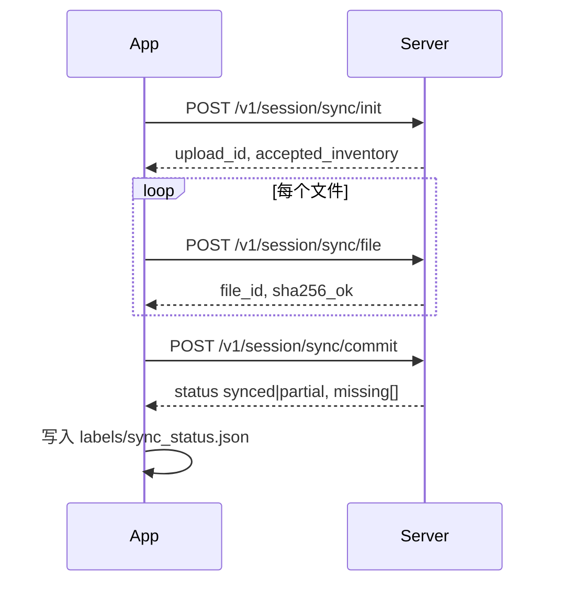

# Nuna 会话数据格式与服务器同步协议（v1）

本文约定 App 端 **会话目录** 结构、**context 多模态标签** 格式，以及 **可断点、可确认** 的服务器同步流程。

如果你正在从零实现自建后端，请先阅读 [SERVER_INTEGRATION.md](SERVER_INTEGRATION.md)；该文档还包含 App 配置、认证、最小音频接口、时间轴、日记和标注契约。

### 实现类索引（App）

| 协议章节 | Kotlin 实现 |
|----------|-------------|
| §1 目录结构 | `session/SessionPaths.kt` |
| §1.1 `manifest.json` | `session/SessionManifest.kt` |
| §1.2 `context/context.jsonl` | `service/ContextDataService.kt` |
| §1.3 `labels/sync_status.json` | `sync/SessionSyncStatus.kt` |
| §1 `labels/vad_prelabel.json` | `vad/VadPrelabelWriter.kt` |
| §2 同步流程 | `sync/SessionSyncCoordinator.kt`, `sync/SessionSyncUploader.kt` |

---

## 1. 本地会话目录结构

路径：`Downloads/nuna_{device}_{started_at_ms}/`

| 相对路径 | 说明 |
|----------|------|
| `manifest.json` | 会话元数据、音频分段列表、VAD 摘要 |
| `audio/seg_XXX.opus` | 裸 Opus 流，每段约 60s |
| `audio/timeline.jsonl` | A003 包设备时间戳及音频完整性事件 |
| `context/context.jsonl` | GPS / IMU / **身体活动** 等时序标签（JSONL） |
| `context/mmwave.jsonl` | 可选；Nuna A001 `0x08` 毫米波原始包（JSONL） |
| `context/mmwave_state.jsonl` | 可选；A001 `0x13` 雷达活跃/休眠状态时间线 |
| `labels/vad_prelabel.json` | Silero VAD 预标注 |
| `labels/sync_status.json` | **本机** 服务器同步状态（不上传亦可由服务端生成） |

### 1.1 `manifest.json`（format_version = 1）

见代码 `SessionManifest`；关键字段：

- `session_id`, `started_at_ms`, `ended_at_ms`
- `audio.segments[]`: `index`, `file`, `start_ms`, `end_ms`, `bytes`, `duration_ms`
- `audio.timeline_file` → 固定 `audio/timeline.jsonl`
- `context.file` → 固定 `context/context.jsonl`
- `context.modalities` → 本会话请求采集的模态；包含 `mmwave` 只表示已启用，不等于收到数据
- `context.mmwave` → 毫米波采集结果摘要（见下文）
- `vad` → `labels/vad_prelabel.json`

### 1.2 `context/context.jsonl`（每行一个 JSON）

| type | 含义 | 示例字段 |
|------|------|----------|
| `meta` | 采集开始 | `started_at_ms`, `modalities` |
| `imu` | IMU | `sensor`: accel/gyro/mag, `x,y,z`, `t_ms` |
| `gps` | GPS | `lat,lon,alt,acc,speed,bearing`, `t_ms` |
| `activity` | **身体活动** | `state`: STILL/WALKING/RUNNING/IN_VEHICLE/…, `confidence` 0–100, `t_ms` |

活动状态来自 Android Activity Recognition API（需 Google Play 服务）。

### 1.2.1 `audio/timeline.jsonl`

App 对每个实际交给 Opus 重组器的 A003 包写一行 `audio_packet`，保留
`frame_id`、`chunk_id/total_chunks`、`device_timestamp_ms`、包内 Opus 帧数、
`segment_index`、`received_at_ms` 和 `session_offset_ms`。发现帧号不连续、分块不完整
或异常长度时，另写 `audio_integrity_event`，包括发生时间、分段和原因。用户停止后固件
可能立即停止 A003，使最后一个产品分组来不及收齐；App 丢弃该未完整尾组并写
`audio_boundary_event(event=trimmed_incomplete_tail)`，已完成的 Opus 帧仍可安全使用，
不会把这种预期边界裁剪误判为会话中途丢帧。

`session_offset_ms` 由 Android 单调时钟相对会话起点计算；`received_at_ms` 为
`manifest.started_at_ms + session_offset_ms`。因此录制期间即使系统墙钟被校时，音频、
毫米波和其他使用该会话偏移的事件也不会倒退或跳跃。`device_timestamp_ms` 保留设备原值，
服务端在尚未验证设备时钟漂移前不应直接替代手机会话时间。

### 1.2.2 `context/mmwave.jsonl` 与 `context/mmwave_state.jsonl`（可选）

用户在 App 设置中开启“采集毫米波雷达原始数据（实验）”后，App 在录音会话期间收到
A001 类型 `0x08` 时创建该文件。协议文档尚未定义毫米波
payload 的字段语义，因此 App 不推测心率、呼吸率或活动状态，而是无损保存：

- `received_at_ms` 与 `session_offset_ms`：BLE 回调时立即取得的稳定会话时间；
- `device_timestamp_ms`、`sensor_type`：协议已经定义的字段；
- `payload_base64`：未解释的传感器 payload；
- `raw_packet_base64`：完整 BLE 协议包，供未来重新解析；
- `protocol_version`、`checksum`、`checksum_class`：协议诊断字段。

开启时，`manifest.json` 的 `context.modalities` 和 `context/context.jsonl` 的 meta 行都会
包含 `mmwave`，并通过 `mmwave_file` 指向此文件。若设备没有上报 `0x08`，不会创建该
文件。当前版本会在开始录音前通过 A002 发送控制类型 `0x05`、参数 `0x01` 尝试开启
毫米波雷达；控制失败或超时不会阻断音频兼容流程。停止录音后，App 仅关闭由本次 App
流程开启的雷达，避免覆盖连接前已经存在的设备状态。

产品固件可能周期性省电：A001 `0x13=false` 后暂停 `0x08`，稍后再次
`0x13=true`。App 不会为休眠窗口生成伪造样本，也不会按包序号压缩空白时间；每次状态
变化写入 `context/mmwave_state.jsonl`。当雷达由 App 逻辑开启而设备暂时报告关闭时，
事件 `state` 为 `sleeping`、`requested_by_app=true`。停止录制仍会发送雷达 OFF，休眠
状态不会清除 App 的控制所有权。

`manifest.json` 还会保存可机读的采集结果，避免把“已打开采集开关”和“已经收到数据”
混为一谈：

```json
{
  "context": {
    "modalities": ["imu", "gps", "activity", "mmwave"],
    "mmwave_file": "context/mmwave.jsonl",
    "mmwave_state_file": "context/mmwave_state.jsonl",
    "mmwave": {
      "enabled": true,
      "status": "captured",
      "file": "context/mmwave.jsonl",
      "packet_count": 42,
      "payload_bytes": 840,
      "file_bytes": 16384,
      "malformed_packets": 0,
      "dropped_packets": 0,
      "state_file": "context/mmwave_state.jsonl",
      "state_event_count": 6,
      "state_file_bytes": 1400
    }
  }
}
```

`context.mmwave.status` 的取值：

| 值 | 含义 | 是否有文件可导出 |
|----|------|------------------|
| `disabled` | 本会话未启用毫米波采集 | 否 |
| `waiting` | 录制中，已启用并等待设备 `0x08` 数据 | 尚不确定 |
| `captured` | 至少收到并写入一个有效包 | 是 |
| `no_data` | 会话结束但没有收到有效包 | 否 |
| `finalize_timeout` | 停止时写盘封口超时，需要检查文件 | 视文件是否存在而定 |

App 的录音列表、会话详情和导出对话框会显示这一状态。分享/导出时，
`audio/timeline.jsonl` 随音频导出；勾选“上下文”后，存在的 `mmwave.jsonl` 与
`mmwave_state.jsonl` 会一起导出。完整 v1 会话同步也会把这些 sidecar 纳入 SHA-256
文件清单。旧版逐音频文件上传接口不会携带 sidecar。

### 1.2.3 服务端时间轴合并规则

- 音频帧：`started_at_ms + segment.start_ms + frame_index * 20ms`，同时用
  `audio/timeline.jsonl` 校验设备时间戳和 BLE 缺口。
- 毫米波：直接使用每行 `session_offset_ms`；绝不能从 `packet_index` 推算固定采样时间。
- `mmwave_state` 的 `sleeping → active` 区间是“无观测”，不是零值，也不应插值成连续雷达数据。
- `audio_integrity_event` 覆盖的音频分段应标记低置信度；当前 App 不会自动上传这些损坏分段。
- `audio_boundary_event` 是有记录的边界裁剪，不代表此前完整音频损坏；服务端可正常处理该分段。

### 1.3 `labels/sync_status.json`（客户端维护）

```json
{
  "format_version": 1,
  "session_id": "nuna_device_1779450128225",
  "status": "synced",
  "upload_id": "uuid",
  "server_session_id": "server-optional-id",
  "updated_at_ms": 1779450200000,
  "files": [
    {
      "path": "manifest.json",
      "sha256": "hex",
      "size": 1234,
      "status": "synced",
      "uploaded_at_ms": 1779450190000,
      "error": null
    }
  ],
  "summary": {
    "total": 12,
    "synced": 12,
    "failed": 0,
    "pending": 0
  },
  "last_error": null
}
```

**status 枚举（会话级）**

| 值 | 含义 |
|----|------|
| `none` | 从未同步 |
| `syncing` | 同步进行中（勿删本地文件） |
| `synced` | 服务端已确认全部成功 |
| `partial` | 部分文件失败或 commit 未通过 |
| `failed` | 整体失败（如 init 被拒） |

**files[].status**：`pending` | `uploading` | `synced` | `failed`

---

## 2. 同步流程（推荐服务端实现）

目标：**先登记、再逐文件上传、最后 commit 校验**，避免「发到一半当成功」。


```mermaid
sequenceDiagram
    participant App
    participant Server
    App->>Server: POST /v1/session/sync/init
    Server-->>App: upload_id, accepted_inventory
    loop 每个文件
        App->>Server: POST /v1/session/sync/file
        Server-->>App: file_id, sha256_ok
    end
    App->>Server: POST /v1/session/sync/commit
    Server-->>App: status synced|partial, missing[]
    App->>App: 写入 labels/sync_status.json
```

### 2.1 `POST /thingx/api/v1/session/sync/init`

**Request** `application/json`

```json
{
  "client_upload_id": "uuid-v4",
  "session_id": "nuna_device_1779450128225",
  "user_id": "user-001",
  "device_mac": "AA:BB:CC:DD:EE:FF",
  "started_at_ms": 1779450128225,
  "ended_at_ms": 1779450500000,
  "manifest": { },
  "files": [
    { "path": "manifest.json", "sha256": "...", "size": 2048, "media_type": "application/json" },
    { "path": "context/context.jsonl", "sha256": "...", "size": 8192, "media_type": "application/x-ndjson" },
    { "path": "labels/vad_prelabel.json", "sha256": "...", "size": 4096, "media_type": "application/json" },
    { "path": "audio/seg_000.opus", "sha256": "...", "size": 480000, "media_type": "audio/opus" }
  ]
}
```

**Response** `200`

```json
{
  "upload_id": "server-upload-uuid",
  "server_session_id": "optional",
  "expires_at_ms": 1779453800000
}
```

服务端应保存 **期望文件清单**（path + sha256），未在 commit 中出现则视为未同步。

### 2.2 `POST /thingx/api/v1/session/sync/file`

**Request** `multipart/form-data`

| 字段 | 说明 |
|------|------|
| `upload_id` | init 返回 |
| `relative_path` | 如 `audio/seg_000.opus` |
| `sha256` | 十六进制，与 init 一致 |
| `file` | 二进制 |

**Response** `200`

```json
{
  "relative_path": "audio/seg_000.opus",
  "status": "received",
  "sha256_verified": true,
  "file_id": "optional"
}
```

可重复上传同一路径（幂等）；服务端校验 sha256 不一致返回 `409`。

### 2.3 `POST /thingx/api/v1/session/sync/commit`

**Request** `application/json`

```json
{
  "upload_id": "server-upload-uuid",
  "client_upload_id": "uuid-v4",
  "files": [
    { "path": "manifest.json", "sha256": "..." },
    { "path": "audio/seg_000.opus", "sha256": "..." }
  ]
}
```

**Response** `200`

```json
{
  "status": "synced",
  "missing": [],
  "checksum_mismatch": []
}
```

| status | 含义 |
|--------|------|
| `synced` | 清单内文件全部收到且校验通过 |
| `partial` | 有缺失或校验失败，见 `missing` / `checksum_mismatch` |

**只有 `status == synced` 时，App 将会话标为已同步。**

### 2.4 （可选）`GET /thingx/api/v1/session/sync/status?upload_id=`

用于 App 重启后向服务端查询进度；响应结构与 `sync_status.json` 类似。

---

## 3. 兼容旧接口（回退）

若 v1 接口返回 `404`，App 可回退为 **按文件调用** 既有接口：

`POST /thingx/api/file/upload/audio`（multipart: `file` + `metadata`）

此时 **无法保证会话级 commit**，`sync_status` 记为 `partial`，并在 UI 提示「服务端未升级 v1 同步」。

---

## 4. App 端行为摘要

1. 上传前根据磁盘文件生成 **清单 + SHA-256**。
2. `sync_status.status = syncing`，逐文件更新 `files[].status`。
3. 全部 `synced` 且 commit 返回 `synced` → 会话级 `synced`。
4. 任一失败 → `partial`，UI 展示失败文件数，支持 **重试同步**（仅重传 failed/pending）。

---

## 5. 安全与大小

- 建议 HTTPS；`user_id` / `device_mac` 与现有 metadata 一致。
- 大会话可限制单文件大小或分片（v2）；v1 假定单段 Opus &lt; 64MB。
- `client_upload_id` + `upload_id` 双重关联，防止 commit 错会话。
